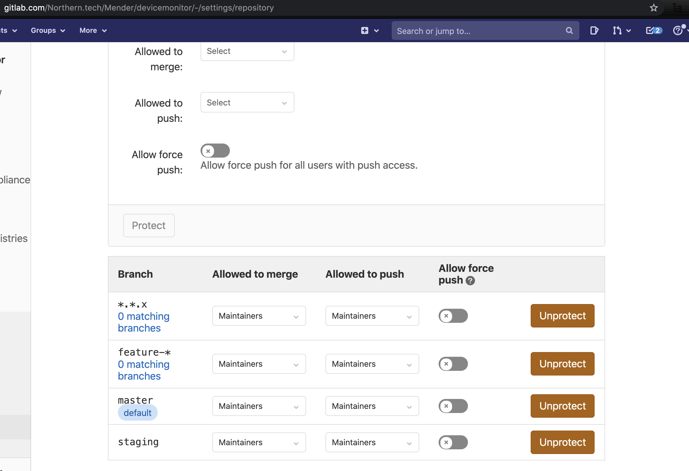

# How to add a new repository into the Mender ecosystem

Adding a new repository requires changes in several places. This document aims to be a full recipe of all components and steps that require modifications.

It is recommended to take a repository in the same domain (backend, client, etc.) as a model when going through the different phases.

## GitHub: create repo and give access

Create the new repository. Consult with the team, epic owner or product owner if the repository is to be open or private

By default, we give write access for `developers` and `rndity` groups. Remove any individual user.

ref https://github.com/mendersoftware/REPOSITORY/settings/access

### Enterprise fork

Create an empty repository in GitHub and push the OS version of it. Notable changes to be made:

1. Change the license to All Rights Reserved and commit
2. Update the `.gitlab-cy.yml` file to set the `FIRST_ENT_COMMIT` in the `test:check-license` job to the commit sha from point 1 (see [example](https://github.com/mendersoftware/deployments-enterprise/blob/master/.gitlab-ci.yml#L35))
3. Modify references in README
4. Modify variables in pipeline
5. Create repository, see Docker image(s) below

## GitLab: project

> NOTE: It may happen that the mender-test-bot has already created the GitLab
> project for you. In this case, you can move straight to point 5 below.
> **However**, if the repository should be public, make sure you reconfigure
> the project visibility in GitLab.

To create the project in GitLab:

1. Open an incognito window in your browser
2. Log into GitHub as `mender-test-bot`, credentials are in `mystiko`
3. Log into GitLab, using OAuth from GitHub. If asked for the token, use the one in `mystiko`
4. New project > Create blank GitLab project
5. Configure branches, permissions, etc, but let the bot do the syncing.

## Fork GitHub project for mender-test-bot

`mender-test-bot` has functionality to automatically create PRs to update enterprise repositories on any merge to open source repository. To make it possible, `mender-test-bot` needs to fork enterprise repository.

To fork the project in GitHub:

1. Log into GitHub as `mender-test-bot`, credentials are in `mystiko`
2. Navigate to enterprise repository, then fork it for `mender-test-bot` user.

## Docker image(s)

When applicable, prepare Docker image repositories for the new component.

* For Open Source repository, create a new public repository in Docker Hub. Teams and permissions:
  * admin: Admin
  * developers: Read-only
  * openrnd: Read-only
  * robots: Read & Write
* For closed source repository, create a new private repository in registry.mender.io, that is
 create the `mendersoftware/name-of-service` ECR repository in the AWS Account with ID `175683096866` to be served by `registry.mender.io`

_Remember_: if you added a new Docker component to the production installation, which
results in a new Docker container running,
check if you have adjusted the `EXPECTED_COUNT_OPENSOURCE` and/or `EXPECTED_COUNT_ENTERPRISE` in:
* [03.Installation-with-docker-compose](https://raw.githubusercontent.com/mendersoftware/mender-docs/master/07.Server-installation/03.Installation-with-docker-compose/docs.md)
* [02.Upgrading-from-OS-to-Enterprise](https://raw.githubusercontent.com/mendersoftware/mender-docs/master/07.Server-installation/03.Installation-with-docker-compose/02.Upgrading-from-OS-to-Enterprise/docs.md)

## Makefile

Consider adding a Makefile to the repository. This will serve both developers on their
local environment and automated templated jobs on CI.

A Makefile in a Mender repository is expected to contain at least the following targets:

* `build`: Build the repository and output all binaries into `./bin`. This is the default target.
* `fmt`: Format the code. Typically with `gofmt` for golang, `Black` for Python, and `clang-format` for C.
* `lint`: Lint the code. On new golang repositories, we are trying to use `golangci-lint` tool.
* `test`: Run unit tests and generate code coverage metrics in file `coverage.txt`.
* `check`: Alias to `test`.

Other useful targets are:

* `docs`: Auto-generate Python test classes for tests
* `docker`: Build Docker production image
* `build-test`: Build binary with code coverage instrumentation
* `docker-test`: Build Docker image containing software under test. Typically using `build-test` target
  for code coverage metrics.
* `docker-acceptance`: Build Docker tester image.
* `acceptance-tests`: Run acceptance tests. Typically bringing up a Docker composition
* `acceptance-tests-logs`: Get logs from acceptance tests Docker composition
* `acceptance-tests-down`: Bring down acceptance tests Docker composition

## GitLab: CI/CD pipeline

Please use templates as much as possible. The standard is a bit different depending on the repository: backend repositories can be built using only templates, client repositories rely on `Makefile` and custom jobs to build and publish.

## GitLab: weekly schedule

Set a weekly schedule to build master pipeline for every Tuesday evening, at 9 PM UTC:

1. Log into GitHub as `mender-test-bot`, credentials are in `mystiko`
2. Log into GitLab, using OAuth from GitHub.
3. Set an CI/CD schedule with description `Weekly` and interval `0 21 * * 2`.

## integration

*NOTE*: needs to be done together with [mender-qa](mender-qa).

*Important*: changes in release_tool and yaml files need to go to integration/master, even when the repository is meant to be used only in a release branch while developing it.

1. Add repo, image, and Docker container to `component-maps.yml`
  * ref https://github.com/mendersoftware/integration/blob/master/component-maps.yml
  * While the repository is in development, set `release_component: false`
  * For non-backend repositories, set `independent_component: true`
2. Add repo to `git-versions.yml` and `git-versions-enterprise.yml` (where applicable)
  * ref https://github.com/mendersoftware/integration/blob/master/git-versions.yml
  * https://github.com/mendersoftware/integration/blob/master/git-versions-enterprise.yml
3. Modify `release_tool.py`
  * ref https://github.com/mendersoftware/integration/blob/master/extra/release_tool.py
  * Add repo to `GIT_TO_BUILDPARAM_MAP`
  * For backend repositories, add repo to `BACKEND_SERVICES_OPEN`, `BACKEND_SERVICES_ENT` or `BACKEND_SERVICES_OPEN_ENT`.
  * If new docker-compose file was added, add the file accordingly in `filter_docker_compose_files_list`.
4. Modify `backend-tests/tests/test_api_endpoints.py`
  * Add the repo to the `REPOS` class variables for the open source and/or enterprise flavors
  * Add the repo to the `REPO_TO_ENV_VARIABLE` map

## mender-qa

1. Modify Mender QA Pipeline:
  * ref https://github.com/mendersoftware/mender-qa/blob/master/.gitlab-ci.yml
  * Add new repo into `variables`
  * Add new call to `checkout_repo` in `init:workspace`.
    * For private repositories, use ssh Git url
2. Modify `servers-build.sh`
  * ref https://github.com/mendersoftware/mender-qa/blob/master/scripts/servers-build.sh
  * Add the new Docker images, if applicable, to `Build server repositories.`

## mender-test-bot (integration-test-runner)

Modify source code:

* Add repository to `defaultWatchRepositories`
* If closed source repo, add it to `enterpriseRepositories`
* If client repository build with yocto, add it to `qemuBuildRepositories`
* If backend repository with enterprise fork, add it to list in `syncIfOSHasEnterpriseRepo`

ref https://github.com/mendersoftware/integration-test-runner/blob/master/main.go

## coveralls

1. Import project in coveralls.
  * ref https://coveralls.io/repos/new
  * If it is a private repo, you might need to resync repos (ref https://coveralls.io/sign-up)
2. Add the token with variable name `COVERALLS_TOKEN` in GitLab CI/CD variables
  * ref https://gitlab.com/Northern.tech/Mender/REPOSITORY/-/settings/ci_cd
3. Set `Coverage Decrease Threshold for failure` to `0.1%`.
  * ref https://coveralls.io/github/mendersoftware/REPOSITORY/settings

## Branch protections

*NOTE:* depends on coveralls, GitLab, mender-qa, and integration-test-runner integration

By default, and both in GitHub and GitLab, we add the following protections for `master`, `*.*.x` and `staging` (where applicable) branches:

* Require pull request reviews before merging
* Require status checks to pass before merging
  * ci/gitlab
  * ci/mender-qa
  * coverage/coveralls

ref https://github.com/mendersoftware/REPOSITORY/settings/branches

ref https://gitlab.com/Northern.tech/Mender/REPOSITORY/-/settings/repository

## dependabot

Please integrate depdendabot as much as possible:

* golang modules
* Docker base image
* Git submodules
* Python packages

## mender-build-status

Add badge to `index.html`

ref https://gitlab.com/Northern.tech/Mender/mender-build-status/-/blob/master/public/index.html

## ME-proxy setup

Update regex in [nginx config](https://github.com/mendersoftware/sre-tools/blob/41e00a1d37a772ebfb3ef3e21345184fae712c19/me-proxy/nginx.conf#L15) by adding a new image name.

## Peer review

Once all the above is done, ping the team to get a full peer review of all the settings.

