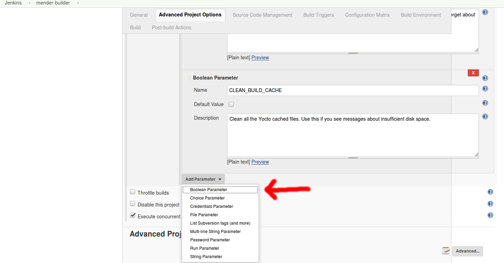
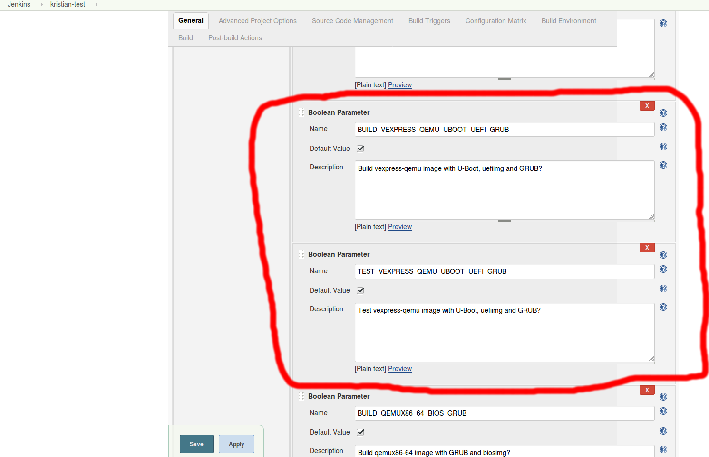
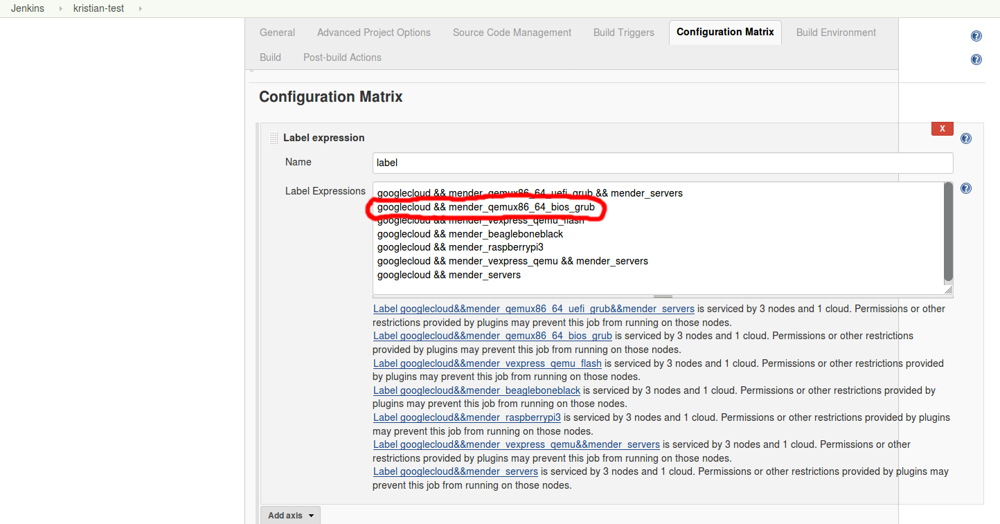
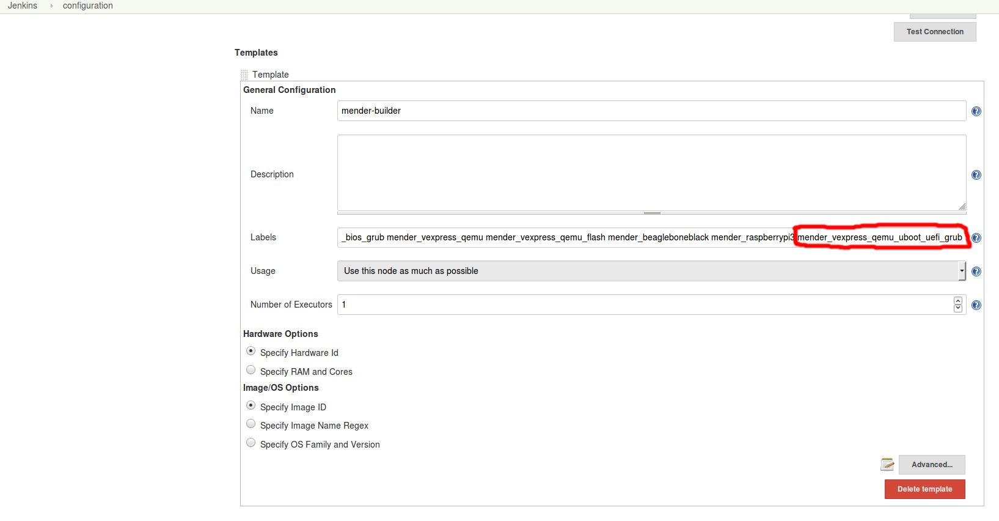

# How to add a platform

This guide describes how to add a new platform to Jenkins, such as for example
"mender_qemux86_64_bios_grub".


## jenkins-yoctobuild-build.sh script

First the platform needs to be added to the build script as a new build
configuration. This is done in the `jenkins-yoctobuild-build.sh` script which is
in the `scripts` folder in this repository. The section looks more or less like
this:

```
# Arguments: Machine name, board name and image name.
add_to_build_list      qemux86-64                qemux86-64-uefi-grub           core-image-full-cmdline
add_to_build_list      vexpress-qemu             vexpress-qemu                  core-image-full-cmdline
add_to_build_list      vexpress-qemu-flash       vexpress-qemu-flash            core-image-minimal
add_to_build_list      $beaglebone_machine_name  beagleboneblack                core-image-base
add_to_build_list      raspberrypi3              raspberrypi3                   core-image-full-cmdline
```

Board name is the most important one as it is the name of the new configuration,
which can be anything, but should reflect what the configuration is, and be
unique.


## Build configuration

Each board needs a build configuration in the `meta-mender` layer, which
includes the Yocto configuration files for that type of build. Here is an
example of such a directory:

```
$ ls meta-mender/tests/build-conf/qemux86-64-bios-grub/
bblayers.conf  local.conf  templateconf.cfg
```

To add a new one, clone the contents of an existing directory into a new
directory with the same name as the board name in the previously mentioned
script, and make the necessary modifications to the Yocto files.


## Jenkins configuration

Start by opening the configuration for the build job. At the time of writing,
this is "mender-builder" and then "Configure".

### Parameters

First you need to add the build parameters for the new platform, which allows
the building and testing of the platform to be turned on and off. This consists
of the two prefixes `BUILD_` and `TEST_`, followed by an uppercase version of
the board name that was added in the `jenkins-yoctobuild-build.sh` script.

1. Click on "Add Parameter" -> "Boolean Parameter"

   

2. Drag the parameter to a "logical" place, for example add the end of the
   current parameter list of platforms. Trust me, this helps a lot later when
   going through parameters and figuring out what to build.

3. Repeat steps 1 and 2 twice and add the two `BUILD_` and `TEST_`
   parameters. The end result should be something like this:

   

### Build matrix

Add the platform label to the build matrix. It is the string "mender_" followed
by the board name from the `jenkins-yoctobuild-build.sh` script.



### Combination filter

The combination filter is a mechanism to only trigger certain job labels
depending on which job parameters have been enabled. For example, if you've
selected only one platform, then this should trigger only one node, not all of
them. Unfortunately the filter is a bit tricky to understand and get right, but
it boils down to an expression that should evaluate to true for platforms that
should run, and false for platforms that shouldn't.

For most platforms, this means adding one expression. However, there is some
additional complexity for platforms that also run integration tests (signaled by
the "mender_servers" label), since these need to run also in the case where only
servers are being tested, and no client platform is built. You can see how this
works around the references to "RUN_INTEGRATION_TESTS".

In this example, we're keeping it simple, and just adding a platform that
doesn't run integration tests. The part in bold is the part we have added, in
this case for the platform "vexpress_qemu_uboot_uefi_grub":

> (label.contains("mender_servers") && "${RUN_INTEGRATION_TESTS}" == "true" && !label.contains("mender_qemux86_64_uefi_grub") && "${BUILD_QEMUX86_64_UEFI_GRUB}" != "true" && !label.contains("mender_vexpress_qemu ") && "${BUILD_VEXPRESS_QEMU}" != "true") || (label.contains("mender_qemux86_64_uefi_grub") && "${BUILD_QEMUX86_64_UEFI_GRUB}" == "true") || **(label.contains("mender_vexpress_qemu_uboot_uefi_grub") && "${BUILD_VEXPRESS_QEMU_UBOOT_UEFI_GRUB}" == "true") ||** (label.contains("mender_qemux86_64_bios_grub") && "${BUILD_QEMUX86_64_BIOS_GRUB}" == "true") || (label.contains("mender_vexpress_qemu ") && "${BUILD_VEXPRESS_QEMU}" == "true") || (label.contains("mender_vexpress_qemu_flash") && "${BUILD_VEXPRESS_QEMU_FLASH}" == "true") || (label.contains("mender_beaglebone") && "${BUILD_BEAGLEBONEBLACK}" == "true") || (label.contains("mender_raspberrypi3") && "${BUILD_RASPBERRYPI3}" == "true")

### Adding the label to the node

You also need to add the platform label to one of the actual nodes, so that one
of them will be used to build the platforms. This is done by entering the main
configuration section of Jenkins, under "Jenkins" -> "Manage Jenkins" ->
"Configure System". For the time being it is under the Google jCloud Provider
plugin section, but this might change. If there are no special requirements for
the node, it can just be added to the list of labels for an existing, generic
build node. For example:




## integration-test-runner

integration-test-runner is the program we currently use to automatically trigger
Jenkins jobs when Github pull requests are created or updated.

1. Change the script in a similar fashion as done in [this
commit](https://github.com/mendersoftware/integration-test-runner/commit/8e01cb8595bb0e56fbdb1b4416c603134f554402)

2. Compile the program locally

3. Log in to our Jenkins server using SSH

4. Run `systemctl stop integration-test-runner`

5. Upload the compiled binary to the root home folder

6. Run `systemctl start integration-test-runner`

7. (Check that it works)


# The end!
