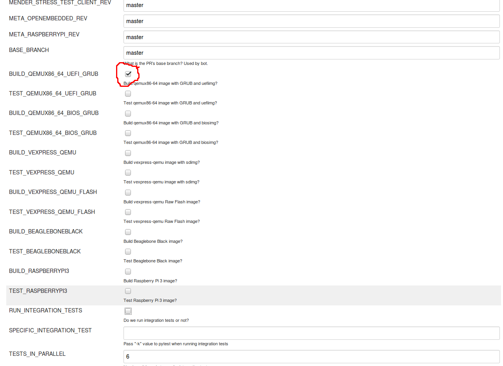
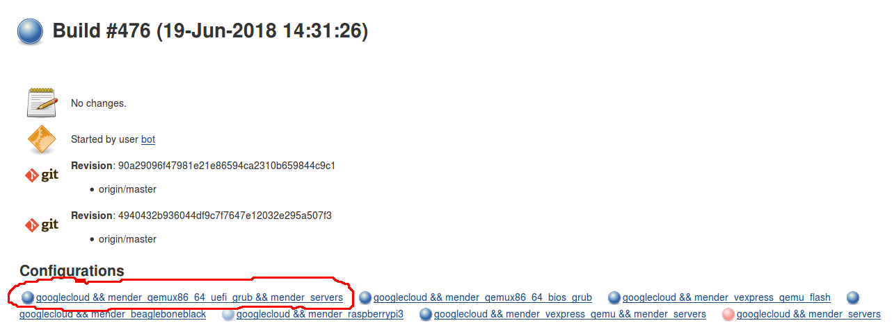
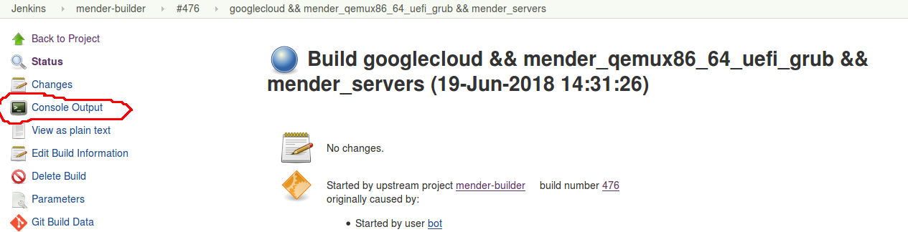
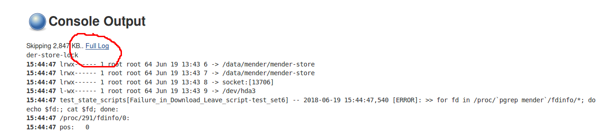
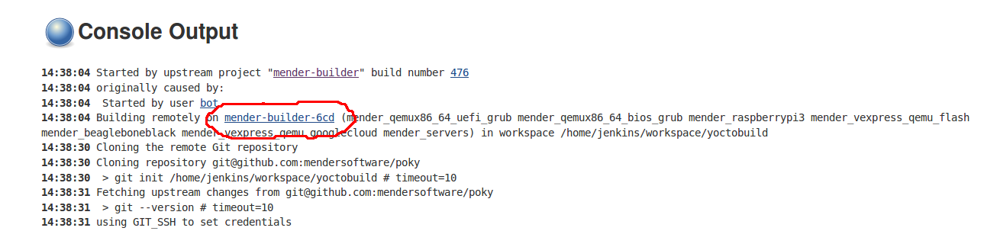
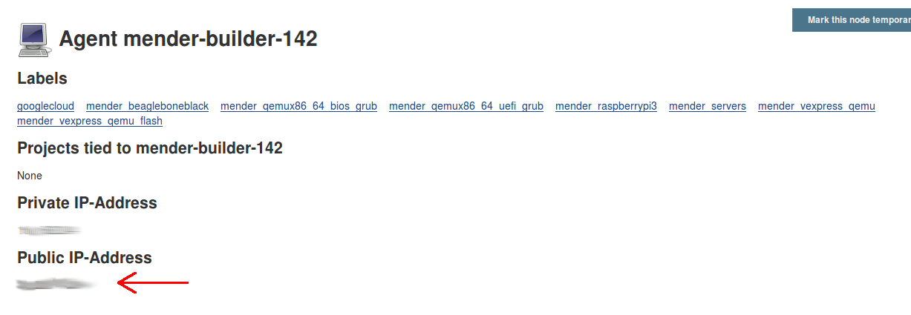

How to debug a build slave
==========================

## Requirements

Your key has to be inserted into the build slave to be able to log in. This
needs to be done before the build slave is spawned. See example below:

```
SSH_KEYS='
ssh-rsa AAAAB3NzaC1yc2...
'
```

Obviously this needs to be merged into the master branch before it will be used
(or it would be very insecure). Once this is done, the next build slave that is
launched should have your key in it.

## How to debug

### Preparing

1. Enable STOP_SLAVE parameter when starting the build

2. Unselect any platforms you don't need, because **all of them will hang after
   the job is complete**, collecting cloud fees. The job will eventually time
   out, but only after many hours.

   

   If the job you're interested in is a server-only job, select only the
   RUN_INTEGRATION_TESTS parameter.

3. Let the job commence until the build slave is finished cloning and has
   started the build steps (this is where they SSH keys are added). It is
   important not to try to log in sooner, because the Google hosts come with a
   preinstalled IP blocker that blocks IPs after a few failed attempts.

4. *(Optional)* If you want to interact with the slave when the normal job steps
   are done, wait until you see it looping on the `stop_slave` file in the
   Jenkins log. Depending on the type of job, this could take a while, since it
   only stops at the end of the job.

At this point you are ready to log in.


### Logging in

1. In Jenkins, enter the correct platform label for the job.

   

2. Click on the "Console log".

   

3. Then click on "Full log" to get the complete console log from the job.

   

4. Very near the top, there is a link which goes to the host that the job is
   executing on. Click on it.

   

5. On the page you get, you can see the external IP.

   

   With this you can log in using:

   ```
   ssh jenkins@<IP>
   ```

   Getting warnings about mismatched SSH keys is pretty common, since the
   machines are respawning again and again and getting new SSH keys all the
   time. Just follow the steps on the screen.

6. Once inside, at least for Mender jobs, the workspace is in
   `$HOME/workspace/yoctobuild`.

Keep in mind that the shell environment of your login is not the same as for the
Jenkins job so you might want to run certain commands to populate the
environment, or take a look at the variable dump from the Jenkins Console log
and set some of those.

Also keep in mind that the `$HOME/stop_slave` file will keep the slave online
for a long time, but not indefinitely. Eventually the Jenkins job will time
out. This is a safety measure to make sure a host won't hang and collect fees
forever.


### After you're done

<!-- Github ignores all HTML tags we can use to add color, so use this terrible
diff hack -->

```diff
-Important: After you're done you must delete the $HOME/stop_slave file, or the-
-host will hang for hours, collecting cloud fees and preventing other jobs from-
-using the slave.-
```


## Tips and tricks

* You can enable the STOP_SLAVE functionality even if you didn't enable it in
  the build parameters. Just log in after the build steps and create the
  `$HOME/stop_slave` file while the build is still running. Note that if you try
  to log in before the build steps have started, you may either not be able to,
  or the build will delete your `stop_slave` file before it has the chance to
  have its effect.
