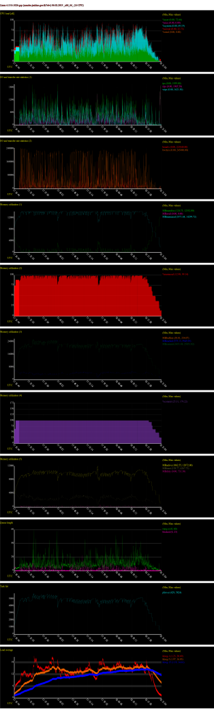

How to debug a build slave
==========================

## Requirements

The recommended method is using Google Cloud SDK. Alternatively you can use
the website to launch SSH sessions with the slaves.

Follow the following guide to get started:
https://cloud.google.com/sdk/docs/quickstart-debian-ubuntu

Important! When selecting the region/zone, you select `northamerica-northeast1-b`

## How to debug via SSH

### Preparing

1. There are three phases where the Pipeline can be stoped: init, build and test.
   Enable the correspoinding WAIT_IN_STAGE_XXX parameter when starting the build

2. Unselect any platforms you don't need, because **all of them will hang after
   the job is complete**, collecting cloud fees. The job will eventually time
   out, but only after many hours.

   If the job you're interested in is a server-only job, select only the
   RUN_INTEGRATION_TESTS parameter.

3. Let the job commence until the build slave is finished cloning and has
   started the build steps (this is where they SSH keys are added). It is
   important not to try to log in sooner, because the Google hosts come with a
   preinstalled IP blocker that blocks IPs after a few failed attempts.

4. *(Optional)* If you want to interact with the slave when the normal job steps
   are done, wait until you see it looping on the `stop_slave` file in the
   log. Depending on the type of job, this could take a while, since it only
   stops at the end of the job.

At this point you are ready to log in.


### Logging in

1. Find the stage/job you are interested in debugging. Open the console
   log for it and find at the start something like:
   `Running on [...] via runner-1spsyixr-gitlab-runner-slave-1573824356-780dc74d`

2. Verify you can see the same instance locally with the command
   `gcloud compute instances list`

3. Log in via SSH to the VM with the command:
   `gcloud compute ssh runner-1spsyixr-gitlab-runner-slave-1573824356-780dc74d`

4. Now we need to go deeper. List the running container with:
   `sudo docker ps`

5. You will get two runnig containers, one with suffix `-docker-0` and other with
   suffix `-build-X`. The later is the one we are interested. To open a shell:
   `sudo docker exec -it runner-1spsyiXR-project-12501706-concurrent-0-build-4 /bin/bash`

   NOTE: on integration tests jobs, that run in Alpine Linux containers, we don't
   have `bash` so you should use `/bin/sh` instead in the above command.

6. The workspace is at `/builds/Northern.tech/Mender`.

7. (for yoctobuilds only). You need to open a new sheel as `mender` user
   to be able to build with bitbake or run accceptance tests:
   `sudo -u mender /bin/bash`

Enjoy your debugging session.


### After you're done

*IMPORTANT*: After you're done you must delete the file
/builds/Northern.tech/Mender/mender-qa/WAIT_IN_STAGE_XXXXX, or the host will hang for
hours, collecting cloud fees and preventing other jobs from using the slave.


## Debugging with monitoring tools
Slaves are being constantly monitored via sysstat:

- [sysstat](https://github.com/sysstat/sysstat), specifically `sar`


### sysstat
The `sar` utility is started in the init script; it collects:
- cpu usage
- load averages
- memory usage
- swap usage

over the whole lifetime of the slave (interval: 2 secs).

The output file is at `/var/log/sysstat/sysstat.log`.

For post mortem analysis, you can find the raw sysstat.log file
and a processed sysstat.svg file in the Artifacts section of
each build and test job.

However, if you need to retreive it while running or in a
situation where the job does not complete, you need to grab
the file via scp:

TODO: how to make this in a nice command? docker + scp
```
gcloud compute ssh <build-slave>`
sudo docker cp <container_id>:/var/log/sysstat/sysstat.log .
exit
gcloud compute scp <build-slave>:sysstat.log .`
```


This file can be processed and reviewed by sysstat's `sadf` utility. The simplest operation
is to dump all charts to svg:

`sadf <your_file_path> -g -- -qurbS > out.svg`



See `man sadf` for othe tips (exporting to other formats, slicing by time and metric, etc.)

## Tips and tricks

* You can enable the STOP_SLAVE functionality even if you didn't enable it in
  the build parameters. Just log in after the build steps, jump into the container,
  and create `/builds/Northern.tech/Mender/mender-qaWAIT_IN_STAGE_BUILD` (or _INIT,
  or TEST) while the build is still running.
