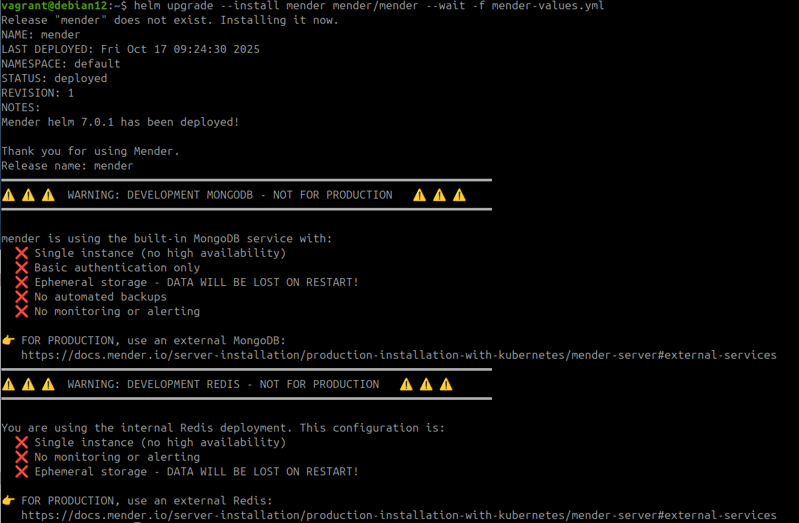

# Testing Mender Server Locally with k8s

This guide describes how to install Mender Server (both Open Source and Enterprise versions) using Kubernetes inside a virtual machine (Vagrant setup).

## Virtual Machine Setup

### Prerequisites

First install Vagrant using [Vagrant installation instructions](https://developer.hashicorp.com/vagrant/install). You also might need additional plugins depending on your virtualization setup.

**For libvirt users** (can be different if using VirtualBox):
```bash
sudo apt install libvirt-dev
vagrant plugin install vagrant-libvirt

# Add your user to libvirt group
sudo usermod -aG libvirt $USER
newgrp libvirt
```

### Create Virtual Machine

Next create a virtual machine where Mender Server will be installed (using generic Debian 12 image):

```bash
mkdir mender-virtual-server
cd mender-virtual-server
vagrant init generic/debian12
```

Above will create a `Vagrantfile` in your working directory. Edit it to add the required configuration:

```ruby
# -*- mode: ruby -*-
# vi: set ft=ruby :

Vagrant.configure("2") do |config|
  config.vm.box = "generic/debian12"

  config.vm.provider "libvirt" do |libvirt|
    # 4GB RAM (8GB recommended for Enterprise); if you see issues increase to 8GB (12 GB for Enterprise)
    libvirt.memory = "4096"
    # 4 CPUs (6 recommended for Enterprise)
    libvirt.cpus = "4"       # 4 CPUs
  end

  # Set up port forwarding so that we will be able to access Mender UI
  # from the host machine.
  #config.vm.network "forwarded_port", guest: 443, host: 8443, host_ip: "127.0.0.1"
  config.vm.network "private_network", ip: "192.168.56.10"

end
```

On the host machine add static VM IP address to `/etc/hosts`. This is required for the ingress controller configuration and accessing UI form the host machine:
```bash
sudo sh -c 'echo "192.168.56.10 mender.local" >> /etc/hosts'
```

Once the configuration is done, start the virtual machine and SSH to it:
```bash
vagrant up --provider=libvirt
vagrant ssh
```

## Mender Server Setup

Once inside the virtual machine, we will set up and start Mender Server. The instructions below contain steps required for both Open Source and Enterprise.

### Overview

For a local test environment, we use:
- **k3s** (lightweight Kubernetes)
- **Included MongoDB, NATS, and Redis** (from Helm Chart; this is not recommended for production but is fine for testing)
- **SeaweedFS** for S3-compatible storage
- **Self-signed certificates** using OpenSSL
- **Local domain** using /etc/hosts

### System Preparation

First, add a local domain to your /etc/hosts:
```bash
sudo sh -c 'echo "127.0.0.1 mender.local" >> /etc/hosts'
```

Install k3s (lightweight Kubernetes) and Helm; follow the [official Mender instructions](https://docs.mender.io/server-installation/production-installation-with-kubernetes/kubernetes#installation-of-kubernetes) or steps below:

```bash
# Install k3s
curl -sfL https://get.k3s.io | sh -s - --write-kubeconfig-mode 644

# Export kubeconfig
export KUBECONFIG=/etc/rancher/k3s/k3s.yaml

# Add to shell profile for persistence
echo 'export KUBECONFIG=/etc/rancher/k3s/k3s.yaml' >> ~/.bashrc
```

Verify installation:
```bash
kubectl get nodes
```

Expected output:
```
NAME                   STATUS   ROLES                  AGE   VERSION
debian12.localdomain   Ready    control-plane,master   1m    v1.33.x+k3s1
```

Install Helm:
```bash
curl https://raw.githubusercontent.com/helm/helm/master/scripts/get-helm-3 | bash
```

Verify installation:
```bash
helm version
```

### Generate Self-Signed Certificate

```bash
# Create directory for certificates
mkdir -p ~/mender-certs
cd ~/mender-certs

# Generate private key
openssl genrsa -out mender.key 2048

# Generate certificate signing request
openssl req -new -key mender.key -out mender.csr \
  -subj "/C=US/ST=State/L=City/O=Mender/CN=mender.local"

# Generate self-signed certificate (valid for 365 days)
openssl x509 -req -days 365 -in mender.csr -signkey mender.key -out server.crt \
  -extfile <(printf "subjectAltName=DNS:mender.local")

# Create Kubernetes TLS secret
kubectl create secret tls mender-ingress-tls \
  --cert=server.crt \
  --key=mender.key

# Verify secret was created
kubectl get secret mender-ingress-tls
```

### Install SeaweedFS (Local S3-Compatible Storage)

You can follow instructions below or [official Mender guide](https://docs.mender.io/server-installation/production-installation-with-kubernetes/storage).

Set up storage configuration:
```bash
export STORAGE_CLASS="local-path"
export STORAGE_BUCKET="mender-artifact-storage"
```

Create SeaweedFS configuration:
```bash
cd ~

cat > seaweedfs.yml <<EOF
filer:
  s3:
    enabled: true
    enableAuth: true
    createBuckets:
      - name: "${STORAGE_BUCKET}"
  storageClass: ${STORAGE_CLASS}

s3:
  enabled: true
  enableAuth: true
EOF
```

Install SeaweedFS:
```bash
helm repo add seaweedfs https://seaweedfs.github.io/seaweedfs/helm
helm repo update
helm install seaweedfs --wait -f seaweedfs.yml seaweedfs/seaweedfs
```

Expected output:
```
NAME: seaweedfs
LAST DEPLOYED: Thu Oct 16 14:59:30 2025
NAMESPACE: default
STATUS: deployed
REVISION: 1
```

Verify SeaweedFS is running:
```bash
kubectl get pods
```

Expected output:
```
NAME                            READY   STATUS    RESTARTS   AGE
seaweedfs-filer-0               1/1     Running   0          81s
seaweedfs-master-0              1/1     Running   0          81s
seaweedfs-s3-5c88cbd4c8-xxxxx   1/1     Running   0          81s
seaweedfs-volume-0              1/1     Running   0          81s
```

Export storage credentials (don't worry about AWS prefixes; this is needed for local installation as well):
```bash
export AWS_ACCESS_KEY_ID=$(kubectl get secret seaweedfs-s3-secret -o jsonpath='{.data.admin_access_key_id}' | base64 -d)
export AWS_SECRET_ACCESS_KEY=$(kubectl get secret seaweedfs-s3-secret -o jsonpath='{.data.admin_secret_access_key}' | base64 -d)
export AWS_REGION="us-east-1"
export STORAGE_ENDPOINT="http://seaweedfs-s3:8333"
```

## Install Mender Server

### Add Mender Helm Repository

```bash
helm repo add mender https://charts.mender.io
helm repo update
```

### Prepare Environment Variables

```bash
export MENDER_SERVER_DOMAIN="mender.local"
export MENDER_SERVER_URL="https://${MENDER_SERVER_DOMAIN}"

# Verify all variables are set
echo "STORAGE_ENDPOINT: $STORAGE_ENDPOINT"
echo "STORAGE_BUCKET: $STORAGE_BUCKET"
echo "MENDER_SERVER_DOMAIN: $MENDER_SERVER_DOMAIN"
echo "MENDER_SERVER_URL: $MENDER_SERVER_URL"
```

### Open Source Configuration

For Open Source, create the configuration file:

```bash
cat > mender-values.yml <<EOF
global:
  s3:
    AWS_URI: "${STORAGE_ENDPOINT}"
    AWS_BUCKET: "${STORAGE_BUCKET}"
    AWS_ACCESS_KEY_ID: "${AWS_ACCESS_KEY_ID}"
    AWS_SECRET_ACCESS_KEY: "${AWS_SECRET_ACCESS_KEY}"
  url: "${MENDER_SERVER_URL}"

api_gateway:
  storage_proxy:
    enabled: true
    url: "${STORAGE_ENDPOINT}"
    customRule: "PathRegexp(\`^/${STORAGE_BUCKET}\`)"

# We will use Traefik that is built-in k3s
ingress:
  enabled: true
  ingressClassName: traefik
  path: /
  hosts:
    - ${MENDER_SERVER_DOMAIN}
  tls:
    - secretName: mender-ingress-tls
      hosts:
        - ${MENDER_SERVER_DOMAIN}

# Use included services (MongoDB, NATS; not recommended for production but fine for testing)
mongodb:
  enabled: true

nats:
  enabled: true
EOF
```

### Enterprise Configuration

For Enterprise, create the configuration file (note `enterprise: true` and `redis`):

```bash
cat > mender-values.yml <<EOF
global:
  enterprise: true
  s3:
    AWS_URI: "${STORAGE_ENDPOINT}"
    AWS_BUCKET: "${STORAGE_BUCKET}"
    AWS_ACCESS_KEY_ID: "${AWS_ACCESS_KEY_ID}"
    AWS_SECRET_ACCESS_KEY: "${AWS_SECRET_ACCESS_KEY}"
  url: "${MENDER_SERVER_URL}"

api_gateway:
  storage_proxy:
    enabled: true
    url: "${STORAGE_ENDPOINT}"
    customRule: "PathRegexp(\`^/${STORAGE_BUCKET}\`)"

# We will use Traefik that is built-in k3s
ingress:
  enabled: true
  ingressClassName: traefik
  path: /
  hosts:
    - ${MENDER_SERVER_DOMAIN}
  tls:
    - secretName: mender-ingress-tls
      hosts:
        - ${MENDER_SERVER_DOMAIN}

# Use included services (MongoDB, NATS, Redis; not recommended for production but fine for testing)
mongodb:
  enabled: true

nats:
  enabled: true

redis:
  enabled: true
EOF
```

#### Enable Server-side generation of Delta Artifacts

For Enterprise, you can enable the Server-side generation of Delta Artifacts with:

```bash
cat >> mender-values.yml <<EOF

generate_delta_worker:
  enabled: true
EOF
```

### Verify Configuration File

**IMPORTANT:** After creating the file, verify that all variables are correctly expanded. There should be NO occurrences of `${VARIABLE_NAME}` in the file.

The correct file should look similar to this:
```yaml
global:
  s3:
    AWS_URI: "http://seaweedfs-s3:8333"
    AWS_BUCKET: "mender-artifact-storage"
    AWS_ACCESS_KEY_ID: "xxxxxx"
    AWS_SECRET_ACCESS_KEY: "xxxxxxxxxxxxxxx"
  url: "https://mender.local"

api_gateway:
  storage_proxy:
    enabled: true
    url: "http://seaweedfs-s3:8333"
    customRule: "PathRegexp(`^/mender-artifact-storage`)"

ingress:
  enabled: true
  ingressClassName: traefik
  path: /
  hosts:
    - mender.local
  tls:
    - secretName: mender-ingress-tls
      hosts:
        - mender.local
```

### Enterprise-Only: Docker Registry Setup

**Skip this section if using Open Source.**

For Enterprise, you need access to the Mender Enterprise Docker registry (`registry.mender.io`). If you don't have credentials, contact your Mender representative.

First, **on the host machine** , verify you have access:
```bash
docker login registry.mender.io
Username: your-username
Password: your-password
```

In case you don't have Docker installed, install it using following commands:
```bash
sudo apt-get update
sudo apt-get install docker.io
sudo usermod -aG docker $USER
newgrp docker
```

Expected output:
```
WARNING! Your credentials are stored unencrypted in '/home/vagrant/.docker/config.json'.
Configure a credential helper to remove this warning. See
https://docs.docker.com/go/credential-store/

Login Succeeded
```

If successful, **back to the virtual machine**, export your secrets and create Kubernetes Docker registry secret:
```bash
export MENDER_REGISTRY_USERNAME="your-username"
export MENDER_REGISTRY_PASSWORD="your-password"
export MENDER_REGISTRY_EMAIL="your-email@example.com"

kubectl create secret docker-registry my-mender-pull-secret \
  --docker-username=${MENDER_REGISTRY_USERNAME} \
  --docker-password=${MENDER_REGISTRY_PASSWORD} \
  --docker-email=${MENDER_REGISTRY_EMAIL} \
  --docker-server=registry.mender.io
```

Expected output:
```
secret/my-mender-pull-secret created
```

Add the image pull secret to your configuration file:
```bash
cat >> mender-values.yml <<EOF

default:
  imagePullSecrets:
    - name: my-mender-pull-secret
EOF
```

## Run Mender Server

Make sure Helm repos are up to date:
```bash
helm repo update
```

Install Mender Server (same command for both Open Source and Enterprise):
```bash
helm upgrade --install mender mender/mender --wait --timeout=20m -f mender-values.yml
```

**Note:** This might take few minutes. You may see some pods returning errors while running. This is expected for migration pods. For example:

```
NAME                               READY   STATUS              RESTARTS   AGE
mender-auditlogs-migration-9w27x   0/1     Error               0          28s
mender-auditlogs-migration-lnc2s   0/1     ContainerCreating   0          0s
mender-mongodb-69f86b6997-h5ln6    0/1     Running             0          28s
seaweedfs-filer-0                  1/1     Running             0          18h
seaweedfs-master-0                 1/1     Running             0          18h
seaweedfs-s3-5c88cbd4c8-prbjd      1/1     Running             0          18h
seaweedfs-volume-0                 1/1     Running             0          18h
```

The pod `mender-auditlogs-migration-9w27x` returned an error because MongoDB wasn't ready yet. It will be replaced with a new pod `mender-auditlogs-migration-lnc2s` that should eventually succeed.

### Monitor Installation Progress

In another terminal, you can monitor pod status:
```bash
kubectl get pods -w
```

Once the installation is successful, you should see output similar to:



Note: You will see warnings that the installation is not meant for production use (MongoDB, Redis, NATS are using built-in non-HA configurations). This is expected for a local test setup.

## Create Users

The user creation process differs between Open Source and Enterprise versions.

### Open Source: Create Admin User

```bash
# Create admin user
USERADM_POD=$(kubectl get pod -l 'app.kubernetes.io/component=useradm' -o name | head -1)
kubectl exec $USERADM_POD -- useradm create-user \
  --username "admin@mender.local" \
  --password "adminpassword"
```

Expected output of the command is user id.

### Enterprise: Create Organization and Admin User

Enterprise uses a multi-tenant architecture. You need to create an organization and admin user:

```bash
# Create organization and admin user
TENANTADM_POD=$(kubectl get pod -l 'app.kubernetes.io/component=tenantadm' -o name | head -1)

TENANT_ID=$(kubectl exec $TENANTADM_POD -- tenantadm create-org \
  --name "Acme" \
  --username "admin@mender.local" \
  --password "adminpassword" \
  --addon troubleshoot \
  --addon monitor \
  --addon configure \
  --plan enterprise)

echo "Tenant ID: $TENANT_ID"

# Save tenant ID for future use
echo $TENANT_ID > ~/mender-tenant-id.txt
```

### Enterprise: Create Additional Users (Optional)

```bash
# Get the tenant ID
TENANT_ID=$(cat ~/mender-tenant-id.txt)
USERADM_POD=$(kubectl get pod -l 'app.kubernetes.io/component=useradm' -o name | head -1)

# Create a regular user
kubectl exec $USERADM_POD -- useradm create-user \
  --username "user@mender.local" \
  --password "userpassword" \
  --tenant-id $TENANT_ID
```

## Access Mender UI

Open your browser **on the host machine** (not in the virtual machine, as we have port forwarding set up) and navigate to the IP address of your VM:

```
https://mender.local/
```

**Login credentials:**

For Open Source or Enterprise admin:
- Username: `admin@mender.local`
- Password: `adminpassword`

For Enterprise regular user:
- Username: `user@mender.local`
- Password: `userpassword`

**Note:** Since we are using a self-signed certificate, you will see a warning that the connection is not trusted. Click "Advanced" and proceed with connecting to your Mender Server.

## Verify Installation

Check all pods are running:
```bash
kubectl get pods
```

All pods should show `Running` or `Completed` status.

Check services:
```bash
kubectl get svc
kubectl get ingress
```

View logs if needed:
```bash
# Example: Check deployments service logs
kubectl logs mender-device-auth-6745b98c5b-k6dkp --tail=50
```

## Upgrade Mender Server

Specify the version to run (or upgrade to) the Mender Server by running the following command (same command for both Open Source and Enterprise):

```bash
VERSION=v4.1.0-saas.16
helm upgrade --install mender mender/mender --set default.image.tag=$VERSION --wait -f mender-values.yml --devel
```

## Tearing Down the Installation

### Uninstall Mender

```bash
helm uninstall mender
```

After uninstalling, you should see only SeaweedFS and MongoDB pods running:
```bash
kubectl get pods
```

Output:
```
NAME                              READY   STATUS    RESTARTS   AGE
mender-mongodb-76c76666d8-xxxxx   1/1     Running   0          15h
seaweedfs-filer-0                 1/1     Running   0          16h
seaweedfs-master-0                1/1     Running   0          16h
seaweedfs-s3-5c88cbd4c8-xxxxx     1/1     Running   0          16h
seaweedfs-volume-0                1/1     Running   0          16h
```

### Clean Up MongoDB

MongoDB persists due to Helm hook behavior. Remove it manually:
```bash
kubectl delete deployment mender-mongodb
```

### Complete Cleanup (Optional)

To remove everything including SeaweedFS:
```bash
# Uninstall SeaweedFS
helm uninstall seaweedfs

# Delete all resources
kubectl delete all,configmap,secret,pvc -l app.kubernetes.io/instance=mender
kubectl delete all,configmap,secret,pvc -l app.kubernetes.io/instance=seaweedfs

# Delete TLS secret
kubectl delete secret mender-ingress-tls

# Verify cleanup
kubectl get all
```

### Destroy the Virtual Machine (Optional)

On your host machine:
```bash
cd mender-virtual-server
vagrant destroy -f
```
