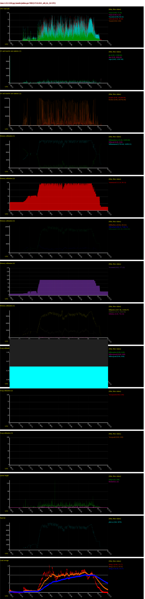
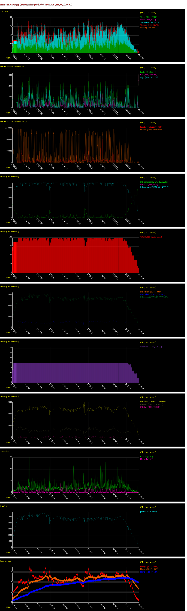
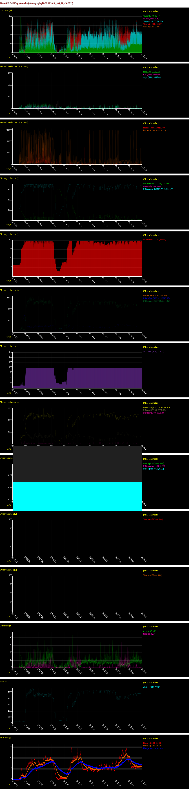
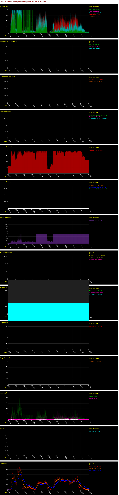
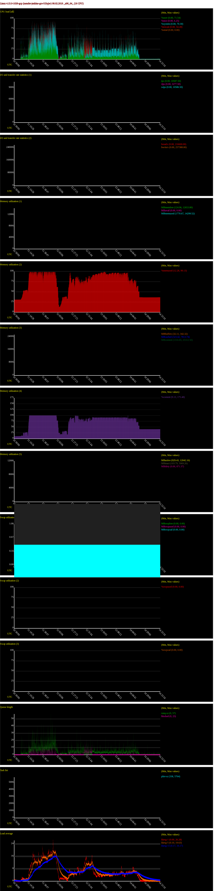

# Performance study 11.02.2019 on GCP slaves

- 3 weeks debugging **master-agent connectivity issues** [QA-51](https://tracker.mender.io/browse/QA-51)
    - 100% builds broken in 5 mins
    - accidental success by replacing JClouds with the GCE plugin
    - still no definite answer

- after solving that - back to  **all other failure modes**
    - max 50/50 successful builds
    - mostly i/o timeouts (mongo), builds hanging forever, some connections refused from conductor (not up on time)
    - decided to approach from a performance angle, added monitoring:
		- [Jenkins Monitoring Plugin](https://mender-jenkins.mender.io/monitoring)
		- homegrown `sysstat` monitoring
		- documented in [how_to_debug_a_build_slave](https://github.com/mendersoftware/mender-qa/blob/master/Documentation/how-to-debug-a-build-slave.md#debugging-with-monitoring-tools) section

- one definite win:
    - limited conductor's heap to 128MB
    - was routinely killing the machine because of OOM (1-2GB x 8 instances)

### Jenkins connectivity issues (QA-51)
- channel routinely terminated
- no definite cause (logs, journal, dmesg, verbose modes...)
- could be anywhere in the chain: jenkins core - plugins - OS (network settings etc.)
- replacing JClouds with GCE alleviated the issue
- conclusions: 
    - we don't have time to handle infra issues ourselves
    - start looking at hosted CI options 

### Performance monitoring
- due to the variety of failure modes, suspect general performance issues
- conductor heap usage hunted down, limiting improved chances of success
- start monitoring via Jenkins Plugin and sysstat

#### Performance - general observations
- instance: 16 cores, 14.4GB
- default parallelism: 8 (x whole docker setup)
- mem: 
    - ~100% usage all the time
- cpu
    - 70-100% usage
    - load avg ~20 (>1 per core - not terrible, but high)
    - qemu: 100% core per instance (x8)
    - java/conductor:
        - from 2%, through 30-70%, to 200-400% in spikes (java GC)
        - penalty for reducing heap - frequent GC sweeps
        - also x8

#### 'Good' builds
- max ~20 load avg
- ~1h20 run time
- small iowait
- examples:

#### 'Bad' builds
- load avg -> 30, 40..., and/or
- huge iowait percentages (processes stuck on I/O)
- tcp io timeouts for mongo

#### Example: A good and bad build 
- good:
    - almost no iowait
    - load avg ~20
- bad: 
    - large iowait percentages
    - load avg up to 30

#### Example: 2 bad builds
- build 1: sudden massive cpu load
    - almost always maxed out
    - 40 load avg, 2.5/core
- build 2: 
    - massive iowait percentages
    - load avg close to 30

#### Note on parallelism
- p=4 gives very similar runtime (1hr20)
- promising lod avg: ~16
- but can also fail sa usual:

#### Hypotheses
- we've simply hit the performance limit
    - scale up - first cpu (because of qemus, java)
    - keep load avg <1 per core always (16-20?)
    - but: legend has it that Greg was able to reproduce those issues at `p=1`, when load is super small
        - in line with the `p=4` experiments - helps, but doesn't solve completely

- xdist distributing work unevenly
    - lucky run - qemu-heavy tests spread out
    - unlucky run - qemus and other heavy resources run at the same time
    - may do sth dumb around fixture parametrization
        - runs >8 tests in parallel?
    - to confirm - need a log parser to gauge test run distribution vs time

- 'second hand host'
    - test run breaks something in the environment
    - next run may be compromised
        - TODO: debug high %iowait, this is what kills the 'next' build
    - but first run sometimes compromised too...
